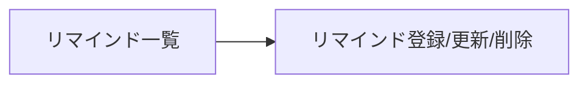

# 画面定義書（リマインダーアプリ）

---

## 1.画面遷移

マーメイド　テキストから図を生成するための言語
ここは要検討　書き方は分かったけどこれで正しいのか。。。

---

## 2.共通仕様

- 対象ユーザー：　個人
- 表示時刻： `hh:mm`
- 日付: `YYYY-MM-DD`
- エラーメッセージ: APIエラーを画面上部に表示（詳細はAPI仕様書）

---

## 3.画面一覧

### 3.1 リマインド一覧

目的

- 登録したリマインドを確認し、登録/編集/削除を行う

表示項目（テーブル）

- タイトル
- コメント
- リマインド時間
- メールアドレス
- メール送信可否

検索/絞り込み(基本)

- 日付指定
-
